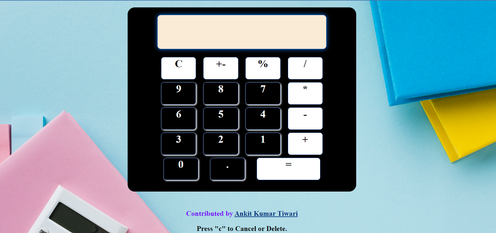

# Calculator Application README

Welcome to our Calculator application! This frontend project is a great way to dive into the world of web development using HTML, CSS, and vanilla JavaScript. Whether you're a seasoned developer looking to brush up on your skills or a beginner eager to learn, this project offers an excellent opportunity to explore frontend technologies.

---
## Application View

## Technologies Used

- **HTML**: Provides the structure and layout of the calculator interface.
- **CSS**: Styles the calculator interface to make it visually appealing and user-friendly.
- **Vanilla JavaScript**: Powers the functionality of the calculator, enabling users to perform various mathematical operations.
- **Media Queries**: Ensures responsiveness across different screen sizes, making the application accessible on desktops, tablets, and mobile devices.

## Features

Our calculator application offers the following features:

- **Keyboard and Button Operation**: Users can operate the calculator using both keyboard inputs and by clicking buttons on the UI.
- **Basic Operations**: Perform addition, subtraction, multiplication, and division with ease.
- **Percentage Calculation**: Calculate percentages effortlessly for quick analysis.
- **Reset Functionality**: Clear the calculator's display and start fresh with the click of a button.
- **Positive/Negative Number Conversion**: Easily convert numbers between positive and negative values for flexible calculations.

## Usage

To use the calculator application, simply open the provided index.html file in your web browser. You can then interact with the calculator interface using your mouse or keyboard.

## Contribution

We welcome contributions from developers of all skill levels. If you're interested in contributing to this project, feel free to submit a pull request (PR) with your proposed changes. Whether it's fixing bugs, adding new features, or improving documentation, your contributions are highly valued.

## Get Started

Ready to dive into frontend development? Clone this repository and start exploring the codebase. Experiment with HTML, CSS, and JavaScript to customize the calculator to your liking. Happy coding!

For any questions or suggestions, please don't hesitate to reach out me - AnkitTiwari10197 at [ankittiwariiit@gmail.com]().

---
